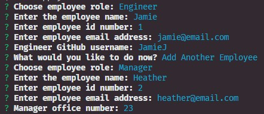

# Employees Summary
  -------
  
  ## Table of Contents

  - [Description](#description)
  - [Installation](#installation)
  - [Usage](#usage)
  - [Tests](#tests)
  - [Contributing](#contributing)
  - [Questions](#questions)

  ## Description:
  
  A CLI app that collects information from a user about their employees and uses that information to generate an HTML file that shows a name, ID, and email for all employees entered. The user can select from the roles: manager, engineer, or intern when creating an employee. The app also asks for office number for managers, GitHub account for Engineers, and school for interns.

  The resulting HTML file will look something like this when opened in the browser:

  
  

  ## Installation:
  
  1. Download the [GitHub repository](https://github.com/PatDowner/employeeSummary.git).
  2. Install npm packages using `npm i`.
  

  ## Usage:
  Watch a [video walk-through](https://drive.google.com/file/d/1XVkTNsr02XRTQ-HdJkr7iLfKr51FLtAF/view) for how to use this app.
  
  1. Run `app.js` file using Node.

  2. Answer the prompts in the terminal. Provide the following information for an employee:
      - role
      - ID number
      - email address

  3. If entering a manager into the app, you will be prompted for their office number.

  4. If entering an Engineer into the app, you will be prompted for their GitHub username.

  5. If entering an Intern into the app, you will be prompted for the school they're attending.

  6. After entering the first employee you can choose if you wish to continue to add more employees.
  

  7. When you are done adding employees, select the finish option which will generate the HTML file `index.html` in the output folder containing all the inputted data about your employees.
  > Note: If an `index.html` file already exists in the output folder, it will be deleted. Please keep this in mind if you will be running this app more than once and back up any information you wish to retain in another file before running this app again.

  
  
  ## Testing:
  
  4 test cases were run for this app using Jest to make sure information comes through as expected.
  
  The files containing the test cases are located in the test folder:
  - `Employee.test.js`
  - `Engineer.test.js`
  - `Intern.test.js`
  - `Manager.test.js`

  This app passes all the tests in each of the 4 cases.
  

  ## Contributing:
  
  Pat Downer
  

  ## Questions:
  
  Github Username: [PatDowner](https://github.com/PatDowner)
  
  Contact me via email at: [pat.downer85@gmail.com](mailto:pat.downer85@gmail.com)
  